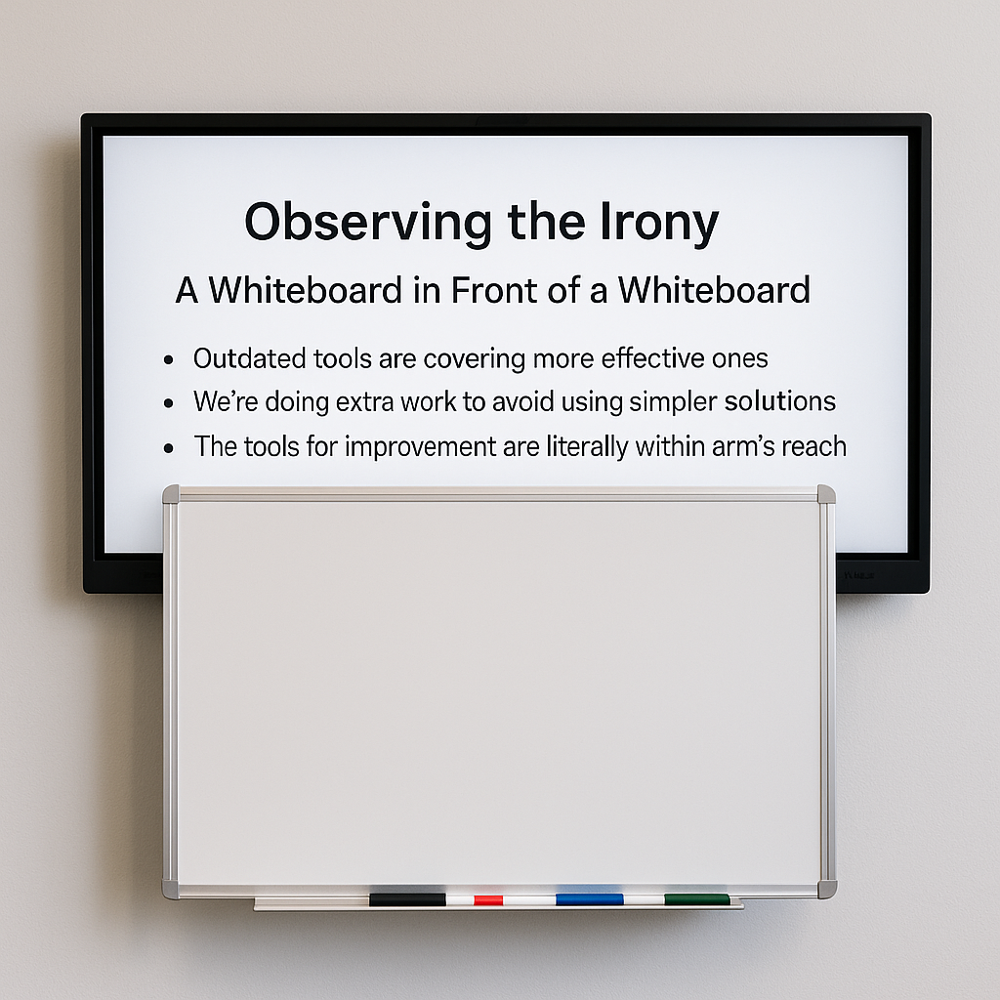

# Digital Whiteboard Integration Proposal

## 1. Introduction

## 1. Introduction
**Title:** *Modernizing Our Whiteboard Workflow*  
**Subtitle:** *From Marker Smudges to Searchable Notes*  
  
📝 *Prepared by [Your Name], [Date]*

---

## 2. Observing the Irony

### A Whiteboard in Front of a Whiteboard

It’s ironic — and telling — that a fully capable digital display is mounted directly behind a traditional dry-erase whiteboard. This configuration serves as an unintentional metaphor:

* Outdated tools are covering more effective ones
* We’re doing extra work to avoid using simpler solutions
* The tools for improvement are literally within arm’s reach

This setup is a reminder that meaningful change often comes not from new tools, but from better use of what we already have.

---

## 3. The Case for Going Digital

* Handwritten notes are prone to erasure or misinterpretation
* Notes on the board are not easily shared between shifts
* Dry-erase boards provide no version history or traceability
* Digital notes can be saved, searched, and shared instantly

[a modern whiteboard](https://s38063.pcdn.co/wp-content/uploads/2023/07/Kanban-template-in-Microsoft-Whiteboard.png.webp)

---

## 4. Leveraging Existing Infrastructure

* A digital board is already mounted and ready to use
* No additional hardware or budget is required
* We can begin using it today with minimal setup

📷 *Image of the digital display, labeled for clarity*
📷 *Side-by-side comparison photo or diagram*

---

## 5. Recommended Applications

Use lightweight and accessible tools:

* **Microsoft Whiteboard** – Seamless integration with Teams and 365
* **Excalidraw** – Fast and open-source with local file support
* **Jamboard** (or OpenBoard alternatives)

Common features include:

* Finger/stylus input
* Save/export options (PNG, PDF)
* Reusability and cloud storage

📷 *Screenshots of each app interface in use*

---

## 6. Proposed Workflow (General Requests Only)

1. Start of shift: Launch whiteboard app
2. Add general notes (maintenance, reminders, tools, etc.)
3. End of shift: Save/export as image or PDF
4. Upload to shared Teams folder or link in Power Apps passdown form

📷 *Mock digital whiteboard with sketch examples*
📷 *Export/save interface screenshot*

---

## 7. Example Use Cases (General, Not Job-Specific)

> ⚠️ *Note: This board is for shift-level communication, not part- or program-specific issues.*

* **"General cleanup needed around Machine 3"**
  ➡️ Operator draws cluttered area
  ✅ Cleanup handled next shift

* **"Need new batteries for edge finder"**
  ➡️ Arrow added to tool area
  ✅ Tool crib notified in advance

* **"Check torque wrench calibration next week"**
  ➡️ Diagram with reminder date
  ✅ Lead confirms it's scheduled

📷 *Screenshots of sketches matching these use cases*

---

## 8. Benefits of the Digital Whiteboard

* Maintains historical record of requests
* Prevents loss of critical notes
* Increases clarity for incoming shifts
* Eases audits and supports training

📷 *Example folder showing stored whiteboard exports*

---

## 9. Pilot Program Proposal

* Trial use of the digital board for one week
* Keep physical board for comparison
* Evaluate ease of use, clarity, and adoption

📷 *Before/after visual comparison of both systems*
📝 *Provide sign-up form for pilot participants*

---

## 10. Conclusion

This isn’t about replacing our whiteboard — it’s about **unlocking the one behind it.**
